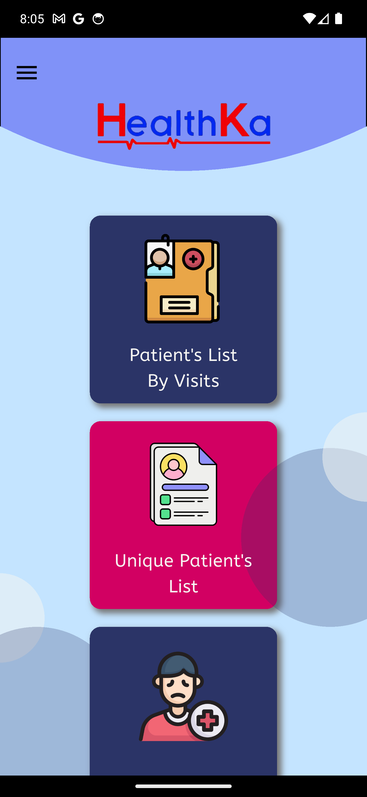
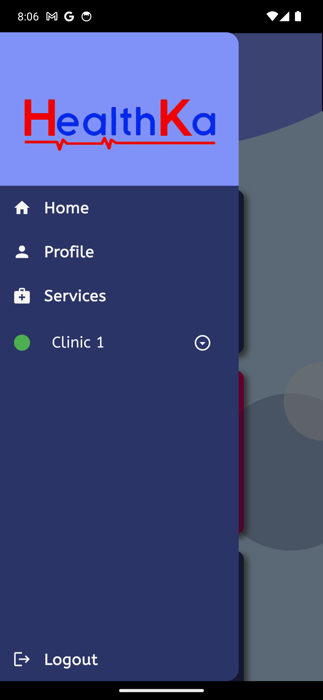
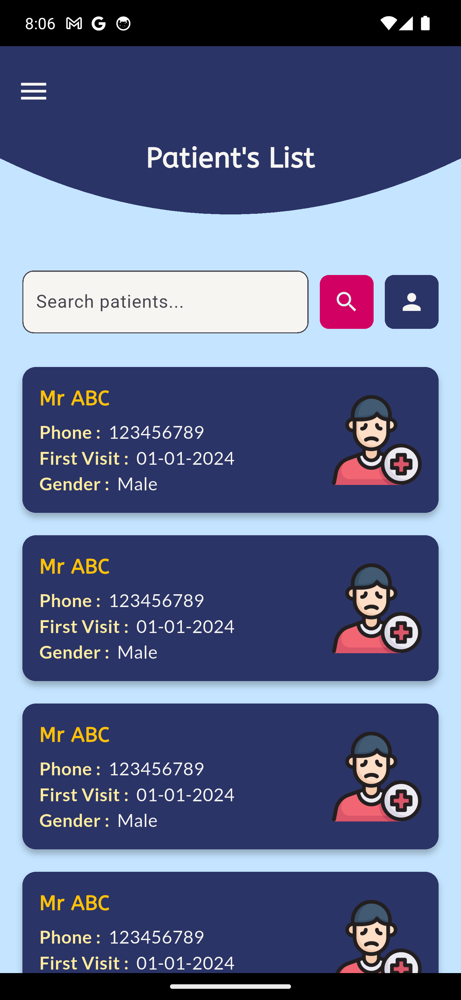
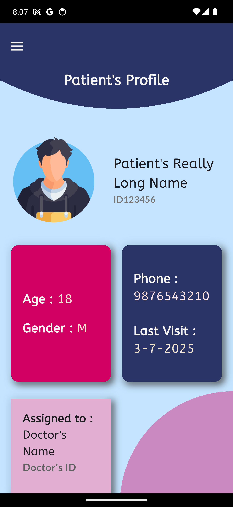
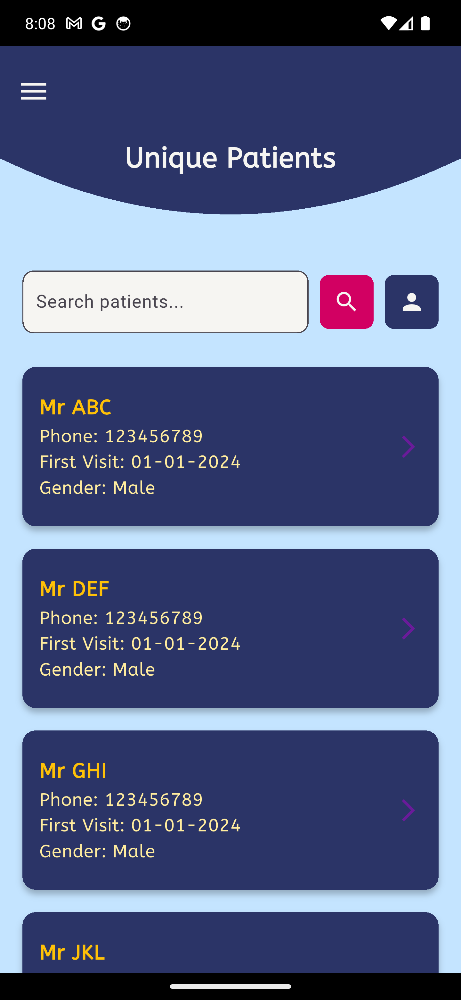
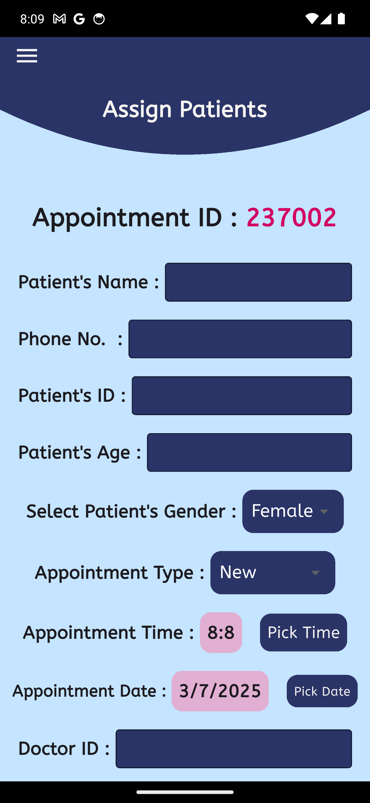
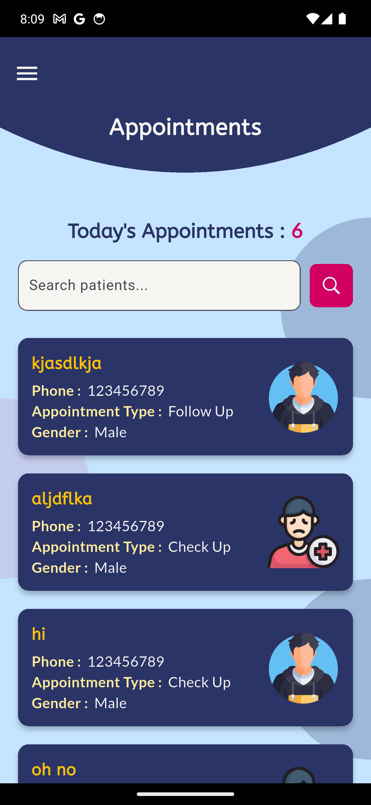
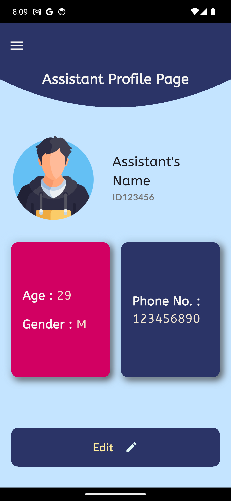

# HealthKa Assistant

A comprehensive Flutter-based health management application designed to streamline clinic operations and patient management for healthcare professionals.

---
## 📚 Table of Contents

- [🏥 Overview](#-overview)
- [🖼️ Screenshots](#-screenshots)
- [✨ Features](#-features)
- [🛠️ Technology Stack](#️-technology-stack)
- [🎨 Design Features](#-design-features)
- [🚀 Getting Started](#-getting-started)

---

## 🏥 Overview

HealthKa Assistant is a modern healthcare management mobile application built with Flutter. The app provides healthcare professionals with tools to efficiently manage patient records, appointments, and clinic services in an intuitive and user-friendly interface.

## 🖼️ Screenshots

<p>
  
  
  
  
  
  
  
  
</p>
## ✨ Features

- **Patient Management**
  - Patient list by visits
  - Unique patient list
  - Patient assignment to providers

- **Appointment Management**
  - Today's appointments with real-time counts
  - Streamlined appointment booking

- **Administrative Tools**
  - Add and manage clinic services
  - Customizable interface and branding

## 🛠️ Technology Stack

- **Framework:** Flutter (Dart)
- **UI Components:** Material Design, custom widgets
- **Typography:** Google Fonts
- **Platforms:** Android, iOS


## 🎨 Design Features

- Custom healthcare-themed color palette
- Responsive layout for all screen sizes
- Reusable widgets for consistent UI/UX
- Material Design principles
- Integrated HealthKa branding

## 🚀 Getting Started

### Prerequisites

- Flutter SDK (>=3.2.4 <4.0.0)
- Dart
- Android Studio or VS Code
- Android/iOS device or emulator

### Installation

1. **Clone the repository**
```
   git clone https://github.com/mayankKushwaha13/healthKaAssistant.git
   cd healthKaAssistant
```
2. **Install dependencies**
```
flutter pub get
```
3. **Run the application**
```
flutter run
```

---
> *HealthKa Assistant is an active project focused on improving healthcare management efficiency through modern mobile technology.*
